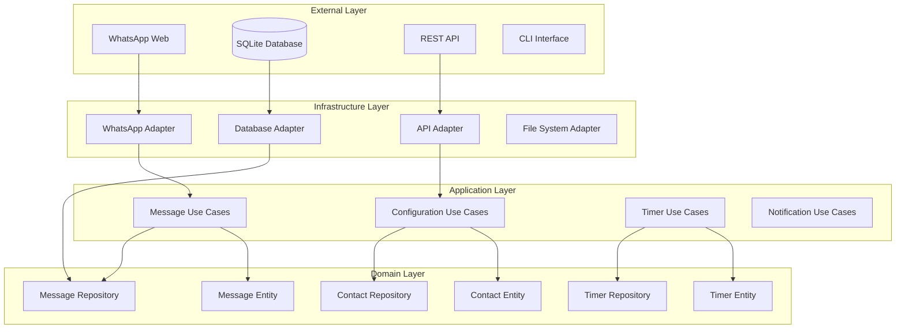

# Design Document

## Overview

El WhatsApp Personal Assistant es un servidor Node.js que utiliza whatsapp-web.js para conectarse a WhatsApp Web y proporcionar funcionalidades de respuesta automática, registro de mensajes y gestión de contactos. El sistema está diseñado para ser autónomo, confiable y fácil de configurar.

## Architecture

### Clean Architecture Overview

El sistema sigue los principios de Clean Architecture con separación clara de responsabilidades:



### Layer Responsibilities

**Domain Layer (Core Business Logic):**
- **Entities**: Message, Contact, Timer, Configuration
- **Repository Interfaces**: Define contracts for data access
- **Domain Services**: Core business rules and validations
- **Value Objects**: Immutable objects representing domain concepts

**Application Layer (Use Cases):**
- **Use Cases**: Orchestrate domain objects to fulfill business requirements
- **Application Services**: Coordinate between use cases
- **DTOs**: Data transfer objects for layer communication
- **Ports**: Interfaces for external dependencies

**Infrastructure Layer (External Concerns):**
- **Adapters**: Implement repository interfaces
- **External Services**: WhatsApp, Database, File System
- **Frameworks**: Express, SQLite, whatsapp-web.js
- **Configuration**: Environment and settings management

**Presentation Layer (User Interface):**
- **Controllers**: Handle HTTP requests and responses
- **CLI Commands**: Command-line interface
- **Middleware**: Authentication, validation, logging

## Components and Interfaces

### Domain Layer

#### Entities

```typescript
// Domain Entities
class Message {
  constructor(
    public readonly id: MessageId,
    public readonly from: ContactId,
    public readonly to: ContactId,
    public readonly content: MessageContent,
    public readonly timestamp: Date,
    public readonly type: MessageType
  ) {}
  
  isFromUser(userId: ContactId): boolean
  isUrgent(): boolean
  requiresAutoResponse(): boolean
}

class Contact {
  constructor(
    public readonly id: ContactId,
    public readonly phoneNumber: PhoneNumber,
    public readonly name: ContactName,
    private config: ContactConfiguration
  ) {}
  
  updateConfiguration(config: ContactConfiguration): Contact
  shouldAutoRespond(): boolean
  getResponseDelay(): number
  getPredefinedMessage(): string | null
}

class Timer {
  constructor(
    public readonly id: TimerId,
    public readonly contactId: ContactId,
    public readonly messageId: MessageId,
    public readonly expiresAt: Date
  ) {}
  
  isExpired(): boolean
  cancel(): Timer
}
```

#### Repository Interfaces (Ports)

```typescript
interface MessageRepository {
  save(message: Message): Promise<void>
  findById(id: MessageId): Promise<Message | null>
  findByContact(contactId: ContactId, limit?: number): Promise<Message[]>
  search(query: string): Promise<Message[]>
  findUnrespondedMessages(contactId: ContactId): Promise<Message[]>
}

interface ContactRepository {
  save(contact: Contact): Promise<void>
  findById(id: ContactId): Promise<Contact | null>
  findByPhoneNumber(phone: PhoneNumber): Promise<Contact | null>
  findAll(): Promise<Contact[]>
  delete(id: ContactId): Promise<void>
}

interface TimerRepository {
  save(timer: Timer): Promise<void>
  findByContact(contactId: ContactId): Promise<Timer | null>
  findExpired(): Promise<Timer[]>
  delete(timerId: TimerId): Promise<void>
}
```

#### Domain Services

```typescript
interface AutoResponseService {
  shouldRespond(message: Message, contact: Contact): boolean
  generateResponse(contact: Contact, message: Message): string
}

interface NotificationService {
  isUrgent(message: Message, contact: Contact): boolean
  sendUrgentNotification(message: Message): Promise<void>
}
```

### Application Layer

#### Use Cases

```typescript
interface ProcessIncomingMessageUseCase {
  execute(command: ProcessIncomingMessageCommand): Promise<void>
}

interface ProcessOutgoingMessageUseCase {
  execute(command: ProcessOutgoingMessageCommand): Promise<void>
}

interface ConfigureContactUseCase {
  execute(command: ConfigureContactCommand): Promise<void>
}

interface StartAutoResponseTimerUseCase {
  execute(command: StartTimerCommand): Promise<void>
}

interface HandleTimerExpirationUseCase {
  execute(command: HandleTimerExpirationCommand): Promise<void>
}

interface GetMessageHistoryUseCase {
  execute(query: GetMessageHistoryQuery): Promise<MessageHistoryResponse>
}
```

#### Commands and Queries

```typescript
// Commands
interface ProcessIncomingMessageCommand {
  messageId: string
  from: string
  content: string
  timestamp: Date
}

interface ConfigureContactCommand {
  contactId: string
  name: string
  phoneNumber: string
  responseDelay: number
  predefinedMessage?: string
  isUrgent: boolean
}

// Queries
interface GetMessageHistoryQuery {
  contactId: string
  limit?: number
  fromDate?: Date
  toDate?: Date
}
```

### Infrastructure Layer

#### Adapters (Implementation of Ports)

```typescript
interface WhatsAppPort {
  sendMessage(to: string, message: string): Promise<void>
  onMessageReceived(callback: (message: RawMessage) => void): void
  initialize(): Promise<void>
  getQRCode(): Promise<string>
}

interface DatabasePort {
  connect(): Promise<void>
  disconnect(): Promise<void>
  transaction<T>(operation: () => Promise<T>): Promise<T>
  migrate(): Promise<void>
  healthCheck(): Promise<boolean>
}

interface QueryBuilder {
  select(table: string): QueryBuilder
  insert(table: string): QueryBuilder
  update(table: string): QueryBuilder
  delete(table: string): QueryBuilder
  where(condition: string, value: any): QueryBuilder
  orderBy(column: string, direction?: 'ASC' | 'DESC'): QueryBuilder
  limit(count: number): QueryBuilder
  build(): { sql: string; params: any[] }
}

interface DatabaseAdapter {
  query<T>(sql: string, params?: any[]): Promise<T[]>
  queryOne<T>(sql: string, params?: any[]): Promise<T | null>
  execute(sql: string, params?: any[]): Promise<{ affectedRows: number; insertId?: any }>
  createQueryBuilder(): QueryBuilder
}

interface FileSystemPort {
  readConfig(path: string): Promise<Configuration>
  writeConfig(path: string, config: Configuration): Promise<void>
}
```

### Presentation Layer

#### Controllers

```typescript
interface MessageController {
  getHistory(req: Request, res: Response): Promise<void>
  search(req: Request, res: Response): Promise<void>
}

interface ContactController {
  create(req: Request, res: Response): Promise<void>
  update(req: Request, res: Response): Promise<void>
  list(req: Request, res: Response): Promise<void>
  delete(req: Request, res: Response): Promise<void>
}

interface SystemController {
  getStatus(req: Request, res: Response): Promise<void>
  getConfig(req: Request, res: Response): Promise<void>
  updateConfig(req: Request, res: Response): Promise<void>
}
```

## Data Models

### Database Schema (Multi-Database Compatible)

#### SQLite Schema
```sql
-- Tabla de mensajes
CREATE TABLE messages (
    id TEXT PRIMARY KEY,
    contact_id TEXT NOT NULL,
    content TEXT NOT NULL,
    timestamp DATETIME NOT NULL,
    type TEXT CHECK(type IN ('incoming', 'outgoing')) NOT NULL,
    is_group BOOLEAN DEFAULT FALSE,
    created_at DATETIME DEFAULT CURRENT_TIMESTAMP,
    FOREIGN KEY (contact_id) REFERENCES contacts(id)
);

-- Tabla de contactos
CREATE TABLE contacts (
    id TEXT PRIMARY KEY,
    name TEXT,
    phone_number TEXT UNIQUE NOT NULL,
    response_delay INTEGER DEFAULT 60,
    predefined_message TEXT,
    is_urgent BOOLEAN DEFAULT FALSE,
    auto_response_enabled BOOLEAN DEFAULT TRUE,
    created_at DATETIME DEFAULT CURRENT_TIMESTAMP,
    updated_at DATETIME DEFAULT CURRENT_TIMESTAMP
);

-- Tabla de configuración global
CREATE TABLE global_config (
    key TEXT PRIMARY KEY,
    value TEXT NOT NULL,
    updated_at DATETIME DEFAULT CURRENT_TIMESTAMP
);

-- Tabla de temporizadores activos
CREATE TABLE active_timers (
    contact_id TEXT PRIMARY KEY,
    message_id TEXT NOT NULL,
    expires_at DATETIME NOT NULL,
    created_at DATETIME DEFAULT CURRENT_TIMESTAMP,
    FOREIGN KEY (contact_id) REFERENCES contacts(id),
    FOREIGN KEY (message_id) REFERENCES messages(id)
);

-- Índices para optimización
CREATE INDEX idx_messages_contact_timestamp ON messages(contact_id, timestamp DESC);
CREATE INDEX idx_messages_timestamp ON messages(timestamp DESC);
CREATE INDEX idx_active_timers_expires ON active_timers(expires_at);
```

#### PostgreSQL Schema
```sql
-- Tabla de mensajes
CREATE TABLE messages (
    id UUID PRIMARY KEY DEFAULT gen_random_uuid(),
    contact_id UUID NOT NULL,
    content TEXT NOT NULL,
    timestamp TIMESTAMPTZ NOT NULL,
    type message_type NOT NULL,
    is_group BOOLEAN DEFAULT FALSE,
    created_at TIMESTAMPTZ DEFAULT NOW(),
    FOREIGN KEY (contact_id) REFERENCES contacts(id) ON DELETE CASCADE
);

-- Tipo enum para PostgreSQL
CREATE TYPE message_type AS ENUM ('incoming', 'outgoing');

-- Tabla de contactos
CREATE TABLE contacts (
    id UUID PRIMARY KEY DEFAULT gen_random_uuid(),
    name TEXT,
    phone_number TEXT UNIQUE NOT NULL,
    response_delay INTEGER DEFAULT 60,
    predefined_message TEXT,
    is_urgent BOOLEAN DEFAULT FALSE,
    auto_response_enabled BOOLEAN DEFAULT TRUE,
    created_at TIMESTAMPTZ DEFAULT NOW(),
    updated_at TIMESTAMPTZ DEFAULT NOW()
);

-- Tabla de configuración global
CREATE TABLE global_config (
    key TEXT PRIMARY KEY,
    value JSONB NOT NULL,
    updated_at TIMESTAMPTZ DEFAULT NOW()
);

-- Tabla de temporizadores activos
CREATE TABLE active_timers (
    contact_id UUID PRIMARY KEY,
    message_id UUID NOT NULL,
    expires_at TIMESTAMPTZ NOT NULL,
    created_at TIMESTAMPTZ DEFAULT NOW(),
    FOREIGN KEY (contact_id) REFERENCES contacts(id) ON DELETE CASCADE,
    FOREIGN KEY (message_id) REFERENCES messages(id) ON DELETE CASCADE
);

-- Índices para optimización
CREATE INDEX idx_messages_contact_timestamp ON messages(contact_id, timestamp DESC);
CREATE INDEX idx_messages_timestamp ON messages(timestamp DESC);
CREATE INDEX idx_active_timers_expires ON active_timers(expires_at);
CREATE INDEX idx_messages_content_gin ON messages USING gin(to_tsvector('spanish', content));

-- Trigger para updated_at automático
CREATE OR REPLACE FUNCTION update_updated_at_column()
RETURNS TRIGGER AS $$
BEGIN
    NEW.updated_at = NOW();
    RETURN NEW;
END;
$$ language 'plpgsql';

CREATE TRIGGER update_contacts_updated_at BEFORE UPDATE ON contacts
    FOR EACH ROW EXECUTE FUNCTION update_updated_at_column();
```

### Database Migration System

```typescript
interface Migration {
  version: number
  name: string
  up: (adapter: DatabaseAdapter) => Promise<void>
  down: (adapter: DatabaseAdapter) => Promise<void>
}

interface MigrationRunner {
  getCurrentVersion(): Promise<number>
  runMigrations(): Promise<void>
  rollback(targetVersion: number): Promise<void>
}
```

### Configuration Files

**config/default.json**
```json
{
  "whatsapp": {
    "sessionPath": "./sessions",
    "puppeteerOptions": {
      "headless": true,
      "args": ["--no-sandbox"]
    }
  },
  "database": {
    "type": "sqlite",
    "sqlite": {
      "path": "./data/assistant.db",
      "enableWAL": true,
      "busyTimeout": 30000
    },
    "postgresql": {
      "host": "localhost",
      "port": 5432,
      "database": "whatsapp_assistant",
      "username": "assistant_user",
      "password": "${DB_PASSWORD}",
      "ssl": false,
      "poolSize": 10,
      "connectionTimeout": 30000
    }
  },
  "server": {
    "port": 3000,
    "host": "localhost"
  },
  "defaults": {
    "responseDelay": 60,
    "autoMessage": "Hola! Este es un mensaje automático. Te responderé pronto."
  }
}
```

**config/production.json**
```json
{
  "database": {
    "type": "postgresql",
    "postgresql": {
      "host": "${DB_HOST}",
      "port": "${DB_PORT}",
      "database": "${DB_NAME}",
      "username": "${DB_USER}",
      "password": "${DB_PASSWORD}",
      "ssl": true,
      "poolSize": 20,
      "connectionTimeout": 30000
    }
  },
  "server": {
    "port": "${PORT}",
    "host": "0.0.0.0"
  }
}
```

## Error Handling

### Connection Errors
- **WhatsApp desconexión**: Reintentar conexión automáticamente con backoff exponencial
- **QR Code expirado**: Generar nuevo QR y notificar al usuario
- **Rate limiting**: Implementar cola de mensajes con delays apropiados

### Database Errors
- **Conexión perdida**: Reintentar operaciones con circuit breaker
- **Corrupción de datos**: Backup automático y recuperación
- **Espacio insuficiente**: Limpieza automática de mensajes antiguos (configurable)

### Message Handling Errors
- **Mensaje no enviado**: Reintentar hasta 3 veces con delay incremental
- **Formato inválido**: Registrar error y continuar procesamiento
- **Contacto bloqueado**: Marcar contacto como inactivo

### Error Recovery Strategies
```typescript
interface ErrorHandler {
  handleWhatsAppError(error: WhatsAppError): Promise<void>
  handleDatabaseError(error: DatabaseError): Promise<void>
  handleNetworkError(error: NetworkError): Promise<void>
}
```

## Testing Strategy

### Unit Testing
- **Componentes individuales**: Cada manager y handler
- **Mocking**: WhatsApp Web API, base de datos, timers
- **Coverage objetivo**: 80% mínimo

### Integration Testing
- **Flujo completo**: Mensaje entrante → Timer → Respuesta automática
- **Base de datos**: Operaciones CRUD completas
- **API endpoints**: Todos los endpoints REST

### End-to-End Testing
- **Simulación de WhatsApp**: Usar whatsapp-web.js en modo test
- **Escenarios reales**: Múltiples contactos, mensajes concurrentes
- **Configuraciones**: Diferentes configuraciones de contactos

### Performance Testing
- **Carga de mensajes**: 100+ mensajes simultáneos
- **Memoria**: Monitoreo de memory leaks
- **Base de datos**: Consultas con grandes volúmenes de datos

### Testing Tools
- **Jest**: Framework de testing principal
- **Supertest**: Testing de API REST
- **SQLite :memory:**: Base de datos en memoria para tests
- **Mock timers**: Para testing de temporizadores

## Security Considerations

### Authentication
- **WhatsApp Web**: Autenticación mediante QR code
- **API Access**: JWT tokens para acceso a la API
- **Session Management**: Encriptación de sesiones de WhatsApp

### Data Protection
- **Mensajes**: Encriptación en reposo (SQLite con SQLCipher)
- **Configuración**: Variables de entorno para datos sensibles
- **Backups**: Encriptación de backups automáticos

### Network Security
- **HTTPS**: Obligatorio para API endpoints
- **Rate Limiting**: Prevención de ataques de fuerza bruta
- **Input Validation**: Sanitización de todos los inputs

## Deployment and Operations

### System Requirements
- **Node.js**: v18+ LTS
- **RAM**: Mínimo 512MB, recomendado 1GB
- **Storage**: 100MB + espacio para mensajes
- **OS**: Linux, macOS, Windows

### Monitoring
- **Health checks**: Endpoint `/health` para monitoreo
- **Logs**: Structured logging con Winston
- **Metrics**: Prometheus metrics para observabilidad
- **Alertas**: Notificaciones por desconexiones críticas